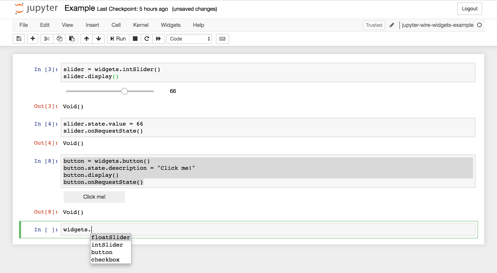

Example jupyter kernel with ipywidgets
--------------------------------------

This example implements the ipywidgets widget protocol version 2, as well as a few of its widgets. It also comes with a little toy language to try out the widgets. It serves as an example how to setup the widgets and communicate to the frontend.

## What is in the example

### Models

Almost all the models defined in [ipywidgets](https://github.com/jupyter-widgets/ipywidgets/blob/d3cd77aae2e9271ccaf9226c249fa8c6af688ade/packages/schema/jupyterwidgetmodels.latest.md). These models define the messages sent between frontend and backend.

### Widgets

Currently only the following widgets are supported:

- FloatSliderModel
- IntSliderModel
- ButtonModel
- CheckboxModel

You can easily extend the set by registering them in the `WidgetFactory` defined in the `app.d`

### Repl

This example also contains a small repl to construct the widgets, and comes with autocomplete support. See the `Example.ipynb` for more information.

### Limitations

- Changes to a widgets state must be synchronized manually by calling `onRequestState()` on the widget.

- The toy language only supports int, doubles and strings.

- The example has not implemented support for binary data.

## How it works

You can read up on the version 2 of the ipywidgets widget messaging protocol [here](https://github.com/jupyter-widgets/ipywidgets/blob/d3cd77aae2e9271ccaf9226c249fa8c6af688ade/packages/schema/messages.md#widget-messaging-protocol-version-2).

Briefly, it works as follows:

- upon creation of a Widget in the backend, it sends a `commOpenMessage` (for each model), with a `comm_id` referencing this widget
- to send updates to the frontend, it sends the `commMessage` with the modified state
- to display the widget, it send the `displayDataMessage`
- the frontend in turn sends `commMessage`'s for each change

## Using it in your own backend

Most likely you will have your own interpreter in your backend, but you can reuse much of the following code:

- `models.d` is a freestanding file and defines most of the ipywidgets models.
- `widgets.d` depends on `models.d` and implements the state synchronisation with the frontend.
- `app.d` contains the `commOpen`/`commClose`/`commMessage` functions that you will need to implement as well.

## Connecting to other widgets

There are plenty of open source widgets available such as 
[bqplot](https://github.com/bloomberg/bqplot),
[pythreejs](https://github.com/jovyan/pythreejs) and
[ipyleaflet](https://github.com/ellisonbg/ipyleaflet)

If you already have the ipywidgets in your backend, then you will only need to implement the models that correspond with the models of those widgets.

## Write the complete Widget in D

With D's support for WebAssembly it is possible to write a custom widget completely in D. See the [skoppe/spasm-jupyter-widget-example](https://github.com/skoppe/spasm-jupyter-widget-example) for an example.

## Run it yourself

To install locally, copy `kernel.json` from this directory to
`~/.local/share/jupyter/kernels/<name>/kernel.json` (linux) or
`~/Library/Jupyter/kernels/<name>/kernel.json` (mac). The directory
name can be anything. The `widgets_example_kernel` executable build by `dub`
will have to be in the `PATH`, otherwise edit `kernel.json` to point
to the path where it is located.

To install globally, use `/usr/share/jupyter/kernels` (linux and mac) instead of
`~/.local/share/jupyter/kernels`.

And that's it. When you run `jupyter notebook` you'll see `jupyter-wire-widgets-example`
as one of the available kernels. The example here contains a toy programming language with widgets.

See the `Example.ipynb` notebook.

Make sure to install ipywidgets 7.0 first.
